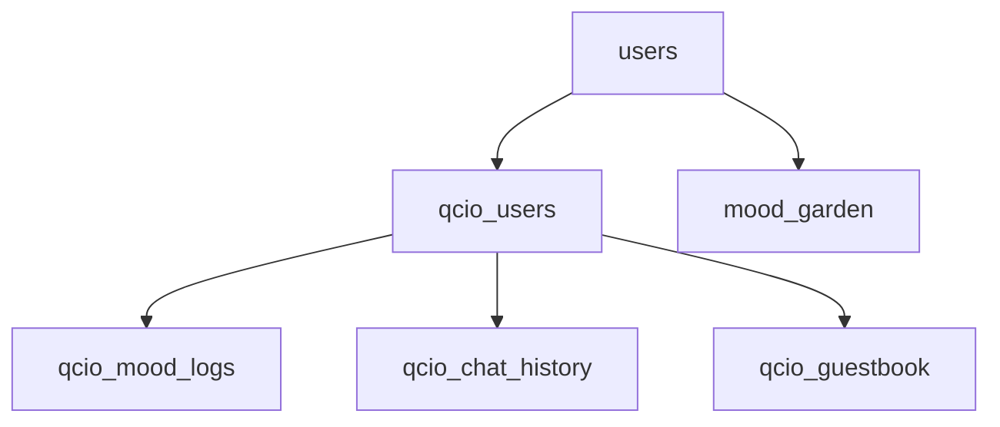

# 千禧时光机 - 数据库设计文档

## 概述

本文档描述了"千禧时光机"微信小程序使用的所有数据库表结构、字段说明及其关联关系。

---

## 数据库表清单

| 表名 | 用途 | 云函数 |
|------|------|--------|
| `users` | 用户基础信息 | user |
| `qcio_users` | QCIO 账号信息 | qcio |
| `qcio_ai_contacts` | AI 好友列表 | qcio |
| `qcio_groups` | 群聊列表 | qcio |
| `qcio_mood_logs` | 用户心情日志 | qcio |
| `qcio_chat_history` | 单人聊天历史 | qcio |
| `qcio_group_chat_history` | 群聊历史 | qcio |
| `qcio_guestbook` | 空间留言板 | qcio |
| `mood_garden` | 心情农场游戏状态 | mood_logic |

---

## 表结构详解

### 1. users - 用户基础信息表

**云函数**: `user`

**用途**: 存储用户的基础登录信息

| 字段名 | 类型 | 说明 | 必填 |
|--------|------|------|------|
| _openid | String | 微信用户唯一标识 | 是 |
| avatarName | String | 用户昵称 | 是 |
| createTime | Date | 创建时间 | 是 |
| lastLoginTime | Date | 最后登录时间 | 是 |
| settings | Object | 用户设置 | 否 |

**索引**: `_openid` (主键)

---

### 2. qcio_users - QCIO 账号信息表

**云函数**: `qcio`

**用途**: QCIO 社交平台的账号信息，包括个人资料、在线状态、空间统计、AI好友分配

| 字段名 | 类型 | 说明 | 必填 | 默认值 |
|--------|------|------|------|--------|
| _openid | String | 微信用户唯一标识 | 是 | - |
| qcio_id | String | 5 位数字账号 (10000-99999) | 是 | 自动生成 |
| password | String | 登录密码 (固定 123456) | 是 | "123456" |
| nickname | String | 用户昵称 | 是 | "千禧网友" |
| signature | String | 个性签名 | 否 | "承諾、絠什嚒用？還bùsんì洅見。" |
| avatar | String | 头像 emoji | 是 | "👤" |
| level | Number | 用户等级 | 是 | 1 |
| isOnline | Boolean | 在线状态 | 是 | false |
| totalVisits | Number | 历史总访问量 | 是 | 0 |
| todayVisits | Number | 今日访问量 | 是 | 0 |
| recentVisitors | Array | 最近 10 位访客记录 | 是 | [] |
| myContacts | Array | 用户分配到的20个AI好友ID列表 | 否 | [] |
| createTime | Date | 账号创建时间 | 是 | serverDate |
| lastLoginTime | Date | 最后登录时间 | 是 | serverDate |

**索引**: `_openid` (主键), `qcio_id` (唯一)

**recentVisitors 数组结构**:
```javascript
{
  visitorId: "12345",      // 访客的 qcio_id
  visitorName: "访客昵称",
  avatar: "👤",
  visitTime: Date,         // 访问时间
  timeStr: "刚刚"          // 相对时间描述
}
```

**myContacts 字段说明**:
- 新用户注册时，从100个AI网友中随机分配20个
- 使用 Fisher-Yates 洗牌算法确保随机性
- 老用户如果没有该字段，会自动补充分配
- 聊天时只显示已分配的20个好友

---

### 3. qcio_ai_contacts - AI 好友列表表

**云函数**: `qcio`

**用途**: 存储预设的 AI 好友信息，包括聊天人设、分组等。目前共100个AI网友，分为12个分组。

| 字段名 | 类型 | 说明 | 必填 | 默认值 |
|--------|------|------|------|--------|
| _id | String | 好友唯一标识 | 是 | 自动生成 |
| name | String | 好友昵称 | 是 | - |
| avatar | String | 头像 emoji | 是 | "👤" |
| status | String | 个性签名 | 是 | - |
| online | Boolean | 是否在线 | 是 | true |
| groupName | String | 所属分组名称 | 是 | "陌生人" |
| groupOrder | Number | 分组排序 | 是 | 0 |
| contactOrder | Number | 联系人排序 | 是 | 0 |
| chatMode | String | 聊天模式 (见下方列表) | 是 | "chat" |
| welcomeMessage | String | 欢迎消息 | 否 | - |
| isEnabled | Boolean | 是否启用 | 是 | true |

**索引**: `groupName`, `groupOrder`, `contactOrder`

**AI 分组列表** (12个分组，100个网友):
| 分组名 | 人数 | 说明 |
|--------|------|------|
| 葬爱家族 | 22人 | 非主流火星文风格 |
| 网游开黑 | 6人 | 游戏爱好者 |
| 网吧常驻 | 6人 | 技术、网吧相关 |
| 网络评论家 | 7人 | 键盘侠、吐槽 |
| 神秘人士 | 9人 | 玄学、中二、AI |
| 情感咨询 | 6人 | 恋爱、八卦 |
| 学霸联盟 | 7人 | 学习、技术 |
| 文艺青年 | 8人 | 诗歌、古风 |
| 娱乐达人 | 7人 | 电影、音乐、段子 |
| 佛系一族 | 5人 | 禅意、极简 |
| 普通人 | 7人 | 日常生活 |
| 工具人 | 10人 | 转换功能类 |

**chatMode 聊天模式列表** (36种):
| 模式 | 名称 | 说明 |
|------|------|------|
| chat | 通用聊天 | 友好、自然的对话风格 |
| qingwu | 轻舞飞扬 | 2000年代非主流火星文风格 |
| sadsoul | 忧郁王子 | 忧伤、emo风格 |
| nostalgic | 往事随风 | 怀旧、回忆杀 |
| samat | 杀马特 | 极端非主流、火星文 |
| longaotian | 龙傲天 | 网络小说主角风格 |
| netadmin | 网管小哥 | 技术宅、网吧管理员 |
| keyboard_warrior | 键盘侠 | 网络评论风格 |
| roaster | 吐槽大师 | 喷子、吐槽风格 |
| mars | 火星文 | 文本转火星文 |
| kaomoji | 颜文字君 | 文本转颜文字 |
| abstract | 抽象大师 | 文本转抽象话Emoji |
| human | 翻译官 | 火星文/抽象话转人话 |
| emo | 伤感语录 | 文本转非主流伤感文案 |
| mood_log | 心情日誌 | 生成QQ空间心情日志 |
| toxic_soup | 毒鸡汤煲 | 励志反向毒鸡汤 |
| joker | 段子手 | 搞笑、段子 |
| fortune_teller | 算命大师 | 玄学、算命 |
| chunibyo | 中二少年 | 中二病、超能力 |
| love_expert | 情感专家 | 恋爱咨询 |
| gossip_girl | 八卦小妹 | 八卦、娱乐 |
| programmer | 程序员 | 代码、技术 |
| sports_fan | 运动达人 | 体育、电竞 |
| math_geek | 数学怪人 | 数学、理科 |
| nerd | 学霸君 | 学习知识 |
| chinglish |中式英语 | Chinglish风格 |
| ancient | 古风居士 | 古文、诗词 |
| poet | 诗人文青 | 诗歌、文艺 |
| down_to_earth | 接地气 | 普通人视角 |
| movie_fan | 影迷 | 电影、追剧 |
| music_lover | 音乐达人 | 音乐、歌曲 |
| artist | 艺术家 | 艺术、创作 |
| buddhist | 佛系青年 | 佛系、随缘 |
| minimalist | 极简大师 | 极简主义 |
| ai_self | AI助手 | AI自我认知 |
| flirt_master | 撩妹高手 | 土味情话 |

**示例数据**:
```javascript
{
  _id: "contact_001",
  name: "轻舞飞扬",
  avatar: "💃",
  status: "滴~ 莪湜輕舞飛颺。莪喜歡看嗼筱說，沵覽悳阣ㄋ嗎？~",
  online: true,
  groupName: "葬爱家族",
  groupOrder: 1,
  contactOrder: 1,
  chatMode: "qingwu",
  welcomeMessage: "滴~ 莪湜輕舞飛颺。莪喜歡看嗼筱說，沵覽悳阣ㄋ嗎？~",
  isEnabled: true
}
```

---

### 4. qcio_groups - 群聊列表表

**云函数**: `qcio`

**用途**: 存储群聊信息，包括群成员列表。目前共6个群聊，每个群18-24人。

| 字段名 | 类型 | 说明 | 必填 | 默认值 |
|--------|------|------|------|--------|
| _id | String | 群唯一标识 | 是 | 自动生成 |
| name | String | 群名称 | 是 | - |
| avatar | String | 群头像 emoji | 是 | "👥" |
| memberCount | Number | 群成员总数 | 是 | 0 |
| mode | String | 默认聊天模式 | 是 | "chat" |
| members | Array | 群成员列表 | 是 | [] |
| groupOrder | Number | 排序 | 是 | 0 |
| isEnabled | Boolean | 是否启用 | 是 | true |

**members 数组格式**:
```javascript
[
  { name: "轻舞飞扬", avatar: "💃", mode: "qingwu" },
  { name: "忧郁王子", avatar: "🚬", mode: "sadsoul" }
]
```

**群聊列表** (6个群):
| 群名 | 人数 | 风格 | 说明 |
|------|------|------|------|
| 葬爱网游家族 | 24人 | qingwu | 葬爱家族+游戏爱好者混合 |
| 网吧技术联盟 | 20人 | netadmin | 技术+网络评论混合 |
| 神秘学园 | 20人 | fortune_teller | 玄学+古风+佛系混合 |
| 情感八卦圈 | 21人 | love_expert | 情感+娱乐八卦混合 |
| 学霸文艺社 | 19人 | nerd | 学习+文艺混合 |
| 普通生活馆 | 18人 | down_to_earth | 普通生活+工具人混合 |

**群聊发言机制**:
- 每次发消息随机选择1-6个群成员回复
- 概率分布：1人40%、2人30%、3人15%、4人8%、5人5%、6人2%
- 群成员列表可在群聊页面展开/收起查看
- AI回复之间有0.8-1.8秒的随机延迟，模拟真实群聊体验

**群成员选择算法** (Fisher-Yates 洗牌):
```javascript
// 随机抽取成员（不重复）
const selected = [];
const available = [...members];

for (let i = 0; i < speakerCount; i++) {
  const randomIndex = Math.floor(Math.random() * available.length);
  selected.push(available[randomIndex]);
  available.splice(randomIndex, 1); // 移除已选的，避免重复
}
```

---

### 5. qcio_mood_logs - 心情日志表

**云函数**: `qcio`

**用途**: 用户在 QQ 空间发布的心情日志

| 字段名 | 类型 | 说明 | 必填 |
|--------|------|------|------|
| _openid | String | 发布者 openid | 是 |
| mood_type | String | 情绪类型 (sad/passionate/sweet/confused) | 是 |
| mood_name | String | 情绪名称 | 是 |
| mood_icon | String | 情绪图标 emoji | 是 |
| keywords | String | 关键词 | 否 |
| content | String | 日志内容 | 是 |
| createTime | Date | 发布时间 | 是 |
| visits | Number | 访问量 | 是 | 0 |
| likes | Number | 点赞数 | 是 | 0 |

**索引**: `_openid`, `createTime` (降序)

**mood_type 对应关系**:
| mood_type | mood_icon | 说明 |
|-----------|-----------|------|
| sad | 💔 | 伤感 |
| passionate | 🔥 | 热情 |
| sweet | 💕 | 甜蜜 |
| confused | 🌫️ | 迷茫 |

---

### 5. qcio_chat_history - 单人聊天历史表

**云函数**: `qcio`

**用途**: 存储用户与单个联系人的聊天记录

| 字段名 | 类型 | 说明 | 必填 |
|--------|------|------|------|
| _openid | String | 用户 openid | 是 |
| contact_name | String | 联系人名称 | 是 |
| messages | Array | 消息列表 | 是 |
| updateTime | Date | 最后更新时间 | 是 |

**索引**: `_openid` + `contact_name` (复合唯一索引)

**messages 数组结构**:
```javascript
{
  type: "me" | "ai",      // 消息类型
  content: "消息内容",
  timestamp: 1234567890   // 时间戳
}
```

---

### 6. qcio_guestbook - 空间留言板表

**云函数**: `qcio`

**用途**: 用户空间的留言记录，包括"踩一踩"自动生成的留言

| 字段名 | 类型 | 说明 | 必填 |
|--------|------|------|------|
| _openid | String | 空间主人 openid | 是 |
| visitorId | String | 访客 qcio_id | 是 |
| visitorName | String | 访客昵称 | 是 |
| avatar | String | 访客头像 emoji | 是 |
| content | String | 留言内容 | 是 |
| createTime | Date | 留言时间 | 是 |

**索引**: `_openid`, `createTime` (降序)

**自动留言内容示例**:
- "路过，踩踩~"
- "来串个门，支持下！"
- "悄悄路过，留个脚印~"
- "路过来看看，不错哦~"

---

### 7. mood_garden - 心情农场游戏表

**云函数**: `mood_logic`

**用途**: 心情农场小游戏的状态数据

| 字段名 | 类型 | 说明 | 必填 |
|--------|------|------|------|
| _openid | String | 用户 openid | 是 |
| currentMood | String | 当前种植的情绪类型 | 是 |
| moodName | String | 情绪名称 | 是 |
| startTime | Date | 开始种植时间 | 是 |
| endTime | Date | 预计成熟时间 | 是 |
| status | String | 状态 (idle/compiling) | 是 |
| totalOutput | Number | 总产量 | 是 | 0 |
| remainingOutput | Number | 剩余产量 | 是 | 0 |
| stealedBy | Array | 被偷记录 | 是 | [] |
| lastModified | Date | 最后修改时间 | 是 |

**索引**: `_openid`

**stealedBy 数组结构**:
```javascript
{
  visitorId: "12345",
  amount: 10,
  time: Date
}
```

---

## 数据关联关系



**说明**:
- `users` 和 `qcio_users` 通过 `_openid` 关联同一用户
- `qcio_users` 是 QCIO 功能的核心表
- `qcio_mood_logs`、`qcio_chat_history`、`qcio_guestbook` 都通过 `_openid` 关联到用户
- `mood_garden` 独立运作，通过 `_openid` 关联用户

---

## 设计规范

### 命名规范
- 表名: `功能模块_子功能` (如 `qcio_users`)
- 字段名: 驼峰命名法 (如 `lastLoginTime`)
- 索引: 主键使用 `_openid`

### 通用字段
- `_openid`: 所有表的关联字段
- `createTime`: 创建时间，统一使用 `db.serverDate()`
- 时间字段: 统一使用 Date 类型

### 数据安全
- 所有云函数都通过 `cloud.getWXContext()` 获取用户 openid
- 数据查询均使用 `.where({ _openid: OPENID })` 确保数据隔离
- 内容安全检测使用微信 `msgSecCheck` API

---

## 功能特性

### 聊天功能安全机制

#### 1. 内容安全检测
使用微信云开发提供的 `msgSecCheck` API 进行内容安全校验：

**检测时机**:
- 用户发送消息时（输入检测）
- AI 生成回复时（输出检测）

**实现代码** (`cloudfunctions/chat/safety.js`):
```javascript
const checkContentSafety = async (cloud, content) => {
  const result = await cloud.openapi.security.msgSecCheck({ content });
  return { safe: result.errCode === 0 };
};
```

**违规处理**:
- 输入违规：返回提示"（系统提示：内容包含敏感词，已被网管屏蔽 v_v）"
- 输出违规：替换为"（内容正在审核中，暂时无法显示...）"

#### 2. 发送频率限制
防止用户过快发送消息：

| 限制项 | 数值 |
|--------|------|
| 冷却时间 | 2000毫秒 (2秒) |
| 超限提示 | "请稍等X秒后再发送" |

**实现代码** (`miniprogram/pages/chat/index.js`):
```javascript
MESSAGE_COOLDOWN: 2000, // 发送冷却时间（毫秒）
lastSendTime: 0,

async sendMessage() {
  const now = Date.now();
  const timeSinceLastSend = now - this.lastSendTime;
  if (timeSinceLastSend < this.MESSAGE_COOLDOWN) {
    const remainingTime = Math.ceil((this.MESSAGE_COOLDOWN - timeSinceLastSend) / 1000);
    wx.showToast({
      title: `请稍等${remainingTime}秒后再发送`,
      icon: 'none'
    });
    return;
  }
  this.lastSendTime = Date.now();
  // ... 继续发送逻辑
}
```

#### 3. 输入长度限制
防止用户输入过长内容：

| 页面 | 最大长度 | 超限提示 |
|------|----------|----------|
| 单人聊天 | 50字 | "最多50字" |
| 群聊 | 50字 | "最多50字" |

**实现代码**:
```javascript
data: {
  maxLength: 50,
  inputLength: 0
},

onChatInput(e) {
  const value = e.detail.value;
  if (value.length > this.data.maxLength) {
    wx.showToast({
      title: `最多${this.data.maxLength}字`,
      icon: 'none'
    });
    return;
  }
  this.setData({
    chatInput: value,
    inputLength: value.length
  });
}
```

### 聊天体验优化

#### 1. 自动滚动到底部
新消息到达时自动滚动到聊天底部：

```javascript
this.setData({
  chatList: newList,
  scrollToView: 'msg-bottom'  // 滚动到最后一条消息
});
```

#### 2. 发送状态提示
| 状态 | 显示 |
|------|------|
| 发送中 | "输入中..." + 加载动画 |
| 发送成功 | 恢复群名显示 |
| 发送失败 | "离线" 状态 |

#### 3. 消息历史管理
- 单人聊天：取最近 20 条作为上下文
- 群聊：取最近 20 条作为上下文
- 聊天记录自动保存到数据库

---

## 维护日志

| 日期 | 版本 | 说明 |
|------|------|------|
| 2024-12 | v1.0 | 初始版本，整理所有数据库表 |
| 2025-01 | v1.1 | 新增 36 种聊天模式，100 个 AI 好友，6 个群聊 |
| 2025-01 | v1.2 | 新增内容安全检测、发送频率限制、输入长度限制 |
| 2025-01 | v1.3 | 新增自动滚动、群成员展开/收起、随机发言机制 |
