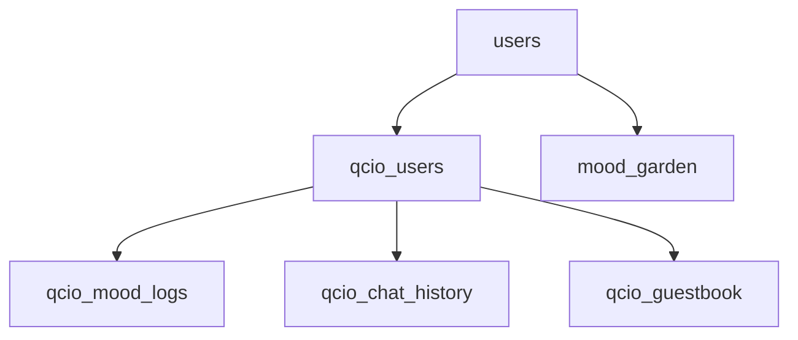

# 千禧时光机 - 数据库设计文档

## 概述

本文档描述了"千禧时光机"微信小程序使用的所有数据库表结构、字段说明及其关联关系。

---

## 数据库表清单

| 表名 | 用途 | 云函数 |
|------|------|--------|
| `users` | 用户基础信息 | user |
| `qcio_users` | QCIO 账号信息 | qcio |
| `qcio_mood_logs` | 用户心情日志 | qcio |
| `qcio_chat_history` | 单人聊天历史 | qcio |
| `qcio_guestbook` | 空间留言板 | qcio |
| `mood_garden` | 心情农场游戏状态 | mood_logic |

---

## 表结构详解

### 1. users - 用户基础信息表

**云函数**: `user`

**用途**: 存储用户的基础登录信息

| 字段名 | 类型 | 说明 | 必填 |
|--------|------|------|------|
| _openid | String | 微信用户唯一标识 | 是 |
| avatarName | String | 用户昵称 | 是 |
| createTime | Date | 创建时间 | 是 |
| lastLoginTime | Date | 最后登录时间 | 是 |
| settings | Object | 用户设置 | 否 |

**索引**: `_openid` (主键)

---

### 2. qcio_users - QCIO 账号信息表

**云函数**: `qcio`

**用途**: QCIO 社交平台的账号信息，包括个人资料、在线状态、空间统计

| 字段名 | 类型 | 说明 | 必填 | 默认值 |
|--------|------|------|------|--------|
| _openid | String | 微信用户唯一标识 | 是 | - |
| qcio_id | String | 5 位数字账号 (10000-99999) | 是 | 自动生成 |
| password | String | 登录密码 (固定 123456) | 是 | "123456" |
| nickname | String | 用户昵称 | 是 | "千禧网友" |
| signature | String | 个性签名 | 否 | "承諾、絠什嚒用？還bùsんì洅見。" |
| avatar | String | 头像 emoji | 是 | "👤" |
| level | Number | 用户等级 | 是 | 1 |
| isOnline | Boolean | 在线状态 | 是 | false |
| totalVisits | Number | 历史总访问量 | 是 | 0 |
| todayVisits | Number | 今日访问量 | 是 | 0 |
| recentVisitors | Array | 最近 10 位访客记录 | 是 | [] |
| createTime | Date | 账号创建时间 | 是 | serverDate |
| lastLoginTime | Date | 最后登录时间 | 是 | serverDate |

**索引**: `_openid` (主键), `qcio_id` (唯一)

**recentVisitors 数组结构**:
```javascript
{
  visitorId: "12345",      // 访客的 qcio_id
  visitorName: "访客昵称",
  avatar: "👤",
  visitTime: Date,         // 访问时间
  timeStr: "刚刚"          // 相对时间描述
}
```

---

### 3. qcio_mood_logs - 心情日志表

**云函数**: `qcio`

**用途**: 用户在 QQ 空间发布的心情日志

| 字段名 | 类型 | 说明 | 必填 |
|--------|------|------|------|
| _openid | String | 发布者 openid | 是 |
| mood_type | String | 情绪类型 (sad/passionate/sweet/confused) | 是 |
| mood_name | String | 情绪名称 | 是 |
| mood_icon | String | 情绪图标 emoji | 是 |
| keywords | String | 关键词 | 否 |
| content | String | 日志内容 | 是 |
| createTime | Date | 发布时间 | 是 |
| visits | Number | 访问量 | 是 | 0 |
| likes | Number | 点赞数 | 是 | 0 |

**索引**: `_openid`, `createTime` (降序)

**mood_type 对应关系**:
| mood_type | mood_icon | 说明 |
|-----------|-----------|------|
| sad | 💔 | 伤感 |
| passionate | 🔥 | 热情 |
| sweet | 💕 | 甜蜜 |
| confused | 🌫️ | 迷茫 |

---

### 4. qcio_chat_history - 单人聊天历史表

**云函数**: `qcio`

**用途**: 存储用户与单个联系人的聊天记录

| 字段名 | 类型 | 说明 | 必填 |
|--------|------|------|------|
| _openid | String | 用户 openid | 是 |
| contact_name | String | 联系人名称 | 是 |
| messages | Array | 消息列表 | 是 |
| updateTime | Date | 最后更新时间 | 是 |

**索引**: `_openid` + `contact_name` (复合唯一索引)

**messages 数组结构**:
```javascript
{
  type: "me" | "ai",      // 消息类型
  content: "消息内容",
  timestamp: 1234567890   // 时间戳
}
```

---

### 5. qcio_guestbook - 空间留言板表

**云函数**: `qcio`

**用途**: 用户空间的留言记录，包括"踩一踩"自动生成的留言

| 字段名 | 类型 | 说明 | 必填 |
|--------|------|------|------|
| _openid | String | 空间主人 openid | 是 |
| visitorId | String | 访客 qcio_id | 是 |
| visitorName | String | 访客昵称 | 是 |
| avatar | String | 访客头像 emoji | 是 |
| content | String | 留言内容 | 是 |
| createTime | Date | 留言时间 | 是 |

**索引**: `_openid`, `createTime` (降序)

**自动留言内容示例**:
- "路过，踩踩~"
- "来串个门，支持下！"
- "悄悄路过，留个脚印~"
- "路过来看看，不错哦~"

---

### 6. mood_garden - 心情农场游戏表

**云函数**: `mood_logic`

**用途**: 心情农场小游戏的状态数据

| 字段名 | 类型 | 说明 | 必填 |
|--------|------|------|------|
| _openid | String | 用户 openid | 是 |
| currentMood | String | 当前种植的情绪类型 | 是 |
| moodName | String | 情绪名称 | 是 |
| startTime | Date | 开始种植时间 | 是 |
| endTime | Date | 预计成熟时间 | 是 |
| status | String | 状态 (idle/compiling) | 是 |
| totalOutput | Number | 总产量 | 是 | 0 |
| remainingOutput | Number | 剩余产量 | 是 | 0 |
| stealedBy | Array | 被偷记录 | 是 | [] |
| lastModified | Date | 最后修改时间 | 是 |

**索引**: `_openid`

**stealedBy 数组结构**:
```javascript
{
  visitorId: "12345",
  amount: 10,
  time: Date
}
```

---

## 数据关联关系



**说明**:
- `users` 和 `qcio_users` 通过 `_openid` 关联同一用户
- `qcio_users` 是 QCIO 功能的核心表
- `qcio_mood_logs`、`qcio_chat_history`、`qcio_guestbook` 都通过 `_openid` 关联到用户
- `mood_garden` 独立运作，通过 `_openid` 关联用户

---

## 设计规范

### 命名规范
- 表名: `功能模块_子功能` (如 `qcio_users`)
- 字段名: 驼峰命名法 (如 `lastLoginTime`)
- 索引: 主键使用 `_openid`

### 通用字段
- `_openid`: 所有表的关联字段
- `createTime`: 创建时间，统一使用 `db.serverDate()`
- 时间字段: 统一使用 Date 类型

### 数据安全
- 所有云函数都通过 `cloud.getWXContext()` 获取用户 openid
- 数据查询均使用 `.where({ _openid: OPENID })` 确保数据隔离

---

## 维护日志

| 日期 | 版本 | 说明 |
|------|------|------|
| 2024-12 | v1.0 | 初始版本，整理所有数据库表 |
